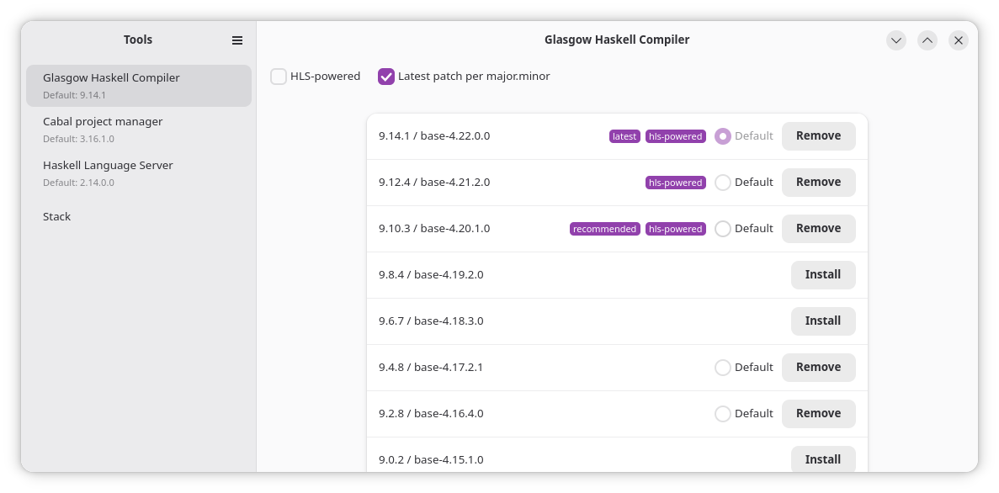
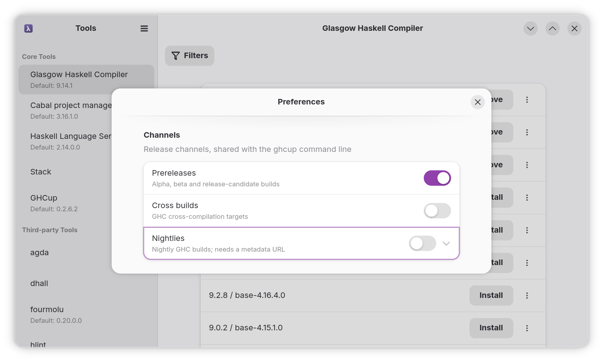

# ghcup-gtk

A GTK4/libadwaita installer for the Haskell toolchain.

It aims to have feature parity with the GHCup TUI.






## Installation

### Linux Distributions

Packages are automatically generated for the following:

* ArchLinux (and derivatives)
* Fedora 44
* Ubuntu 26.04

### macOS

The `.pkg` from the [releases](https://github.com/Kleidukos/ghcup-gtk/releases)
installs a self-contained `GHCup.app` into `/Applications`.
It should be compatible with macOS 15 and up. However the build is not
notarised at this time.

## Development

### System Dependencies

_Please open a ticket if these are not up to date_

_libadwaita 1.5 or newer is required._ Older releases lack `AdwAboutDialog`
and `AdwAlertDialog`.
Debian 12 (1.2) and Ubuntu 22.04 (1.1) are too old and need a backport; Ubuntu 24.04 (1.5) and current Fedora/Arch are fine.

#### Fedora

```bash
$ sudo dnf install gobject-introspection-devel glib2-devel gtk4-devel libadwaita-devel \
  pango-devel cairo-gobject-devel harfbuzz-devel graphene-devel freetype-devel \
  gdk-pixbuf2-devel zlib-ng-compat-devel xz-devel pkgconf-pkg-config gcc make
```

#### Ubuntu/Debian


```bash
sudo apt install build-essential pkg-config libgirepository1.0-dev libglib2.0-dev \
  libgtk-4-dev libadwaita-1-dev libpango1.0-dev libcairo2-dev libharfbuzz-dev \
  libgraphene-1.0-dev libfreetype-dev libgdk-pixbuf-2.0-dev zlib1g-dev liblzma-dev
```


#### Arch


```bash
sudo pacman -S --needed base-devel pkgconf gobject-introspection glib2-devel gtk4 \
  libadwaita pango cairo harfbuzz graphene freetype2 gdk-pixbuf2 zlib xz
```


#### Homebrew

```bash
brew install pkgconf gobject-introspection glib gtk4 libadwaita pango cairo \
  harfbuzz graphene freetype gdk-pixbuf zlib xz
```

#### NixOS

NixOS-based setups are not supported. Please read [Haskell#GHCup](https://wiki.nixos.org/wiki/Haskell#GHCup) on the NixOS Wiki

### Commands

- `make run`: compile and start the application
- `make test`: run the test suite
- `make dist`: build the release tarball


## Verifying release artifacts

Release artifacts are signed with [minisign](https://jedisct1.github.io/minisign/).
The public key is [`release/ghcup-gtk-release.pub`](./release/ghcup-gtk-release.pub)
in this repository, and is also attached to every release.

To verify an artifact, download it along with its `.minisig` signature and run:

```bash
minisign -Vm <artifact> -P RWQC6/WX3yuYGI32C+DSyRvRM6ES628HyiUHx9A+C8UCGa2JCj6Y2vTr
```
